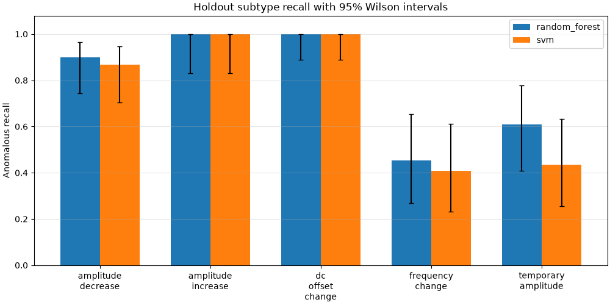

# Synthetic signal classification: experimental results and error review

## Scope and experimental protocol

This report describes a frozen synthetic experiment, not real SPICE/Synopsys
measurements. It adds descriptive analysis without generating data, fitting models,
changing feature definitions, or modifying the GUI.

The dataset has 2,000 independent generated records, 500 per class. Each record has
500 samples at 100 kHz (5 ms); the FFT bin spacing is 200 Hz. Classes share base
frequency/amplitude/phase/offset distributions. The generator seed is 42. The
original 80-signal dataset and models remain in data/development_reference/.

The existing seed-42 stratified split contains 1,500 training and 500 test records
(375/125 per class). Inputs are the same ten numerical features; filename and
all generation metadata are excluded. Preprocessing preserves noise, harmonics
and amplitude changes. SVM scaling stays inside its Pipeline. Three-fold macro
F1 cross-validation uses training data only; it selected Random Forest. The
stored models remain fitted only to the training set. No tuning used this holdout.

Dataset/model hashes and package versions are recorded in
../data/dataset_analysis/experiment_manifest.json. This review checks those hashes,
checks test membership and joins, and reproduces the stored classification reports
from the frozen predictions before writing any interpretation.

## Overall and per-class results

Precision, recall and F1 in the overall table are macro averages.

| model | accuracy | precision | recall | f1 | training_cv_f1 |
| --- | --- | --- | --- | --- | --- |
| random_forest | 0.898 | 0.9027 | 0.898 | 0.8979 | 0.8785 |
| svm | 0.872 | 0.8813 | 0.872 | 0.872 | 0.8424 |

Random Forest makes 51 errors out of 500; SVM makes
64 errors. The original 80-record experiment achieved 90% accuracy
for both models on 20 test records. Changes are −0.2 percentage points for RF and
−2.8 for SVM. Different sample sizes, signal distributions and test cases mean
these are separate experiments, not a controlled comparison on identical data.

| model | class | support | errors | precision | recall | f1 |
| --- | --- | --- | --- | --- | --- | --- |
| random_forest | normal | 125 | 9 | 0.8345 | 0.928 | 0.8788 |
| random_forest | noisy | 125 | 4 | 0.9603 | 0.968 | 0.9641 |
| random_forest | distorted | 125 | 14 | 0.8538 | 0.888 | 0.8706 |
| random_forest | anomalous | 125 | 24 | 0.9619 | 0.808 | 0.8783 |
| svm | normal | 125 | 12 | 0.7847 | 0.904 | 0.8401 |
| svm | noisy | 125 | 3 | 0.9457 | 0.976 | 0.9606 |
| svm | distorted | 125 | 19 | 0.8154 | 0.848 | 0.8314 |
| svm | anomalous | 125 | 30 | 0.9794 | 0.76 | 0.8559 |

The largest per-class weakness is anomalous recall. Normal/distorted confusion
also occurs, so harmonic features help but do not separate every record.
Confusion-matrix CSVs and every misclassified signal are available under
../data/error_analysis/; they are derived from exactly the saved holdout predictions.

## Anomaly subtype results and uncertainty

| model | anomaly_type | support | correct | missed | recall | recall_ci_low | recall_ci_high |
| --- | --- | --- | --- | --- | --- | --- | --- |
| random_forest | amplitude_decrease | 30 | 27 | 3 | 0.9 | 0.7438 | 0.9654 |
| random_forest | amplitude_increase | 19 | 19 | 0 | 1.0 | 0.8318 | 1.0 |
| random_forest | dc_offset_change | 31 | 31 | 0 | 1.0 | 0.8897 | 1.0 |
| random_forest | frequency_change | 22 | 10 | 12 | 0.4545 | 0.2692 | 0.6534 |
| random_forest | temporary_amplitude | 23 | 14 | 9 | 0.6087 | 0.4079 | 0.7784 |
| svm | amplitude_decrease | 30 | 26 | 4 | 0.8667 | 0.7032 | 0.9469 |
| svm | amplitude_increase | 19 | 19 | 0 | 1.0 | 0.8318 | 1.0 |
| svm | dc_offset_change | 31 | 31 | 0 | 1.0 | 0.8897 | 1.0 |
| svm | frequency_change | 22 | 9 | 13 | 0.4091 | 0.2326 | 0.6127 |
| svm | temporary_amplitude | 23 | 10 | 13 | 0.4348 | 0.2563 | 0.6319 |

The intervals are descriptive 95% Wilson intervals for recall, treating records
as independent binomial outcomes. They quantify finite-sample uncertainty within
this synthetic holdout; they do not measure simulator/domain uncertainty. No
multiple-comparison correction or claim of statistically significant model
superiority is made. Even 19/19 or 31/31 detections do not establish perfect
sensitivity. Counts are small, and subtype proportions are generator choices.

Frequency changes account for 12 of RF's 24 missed anomalies and 13 of SVM's 30.
Temporary-amplitude changes contribute another 9 RF misses and 13 SVM misses.
Together those two subtypes account for 21/24 RF and 26/30 SVM anomaly misses.
These are observed counts. Reasons below are hypotheses, not causal conclusions.

## Plausible limitations of the current features

| model | subtype | outcome | support | dominant_frequency_in_800_1200 |
| --- | --- | --- | --- | --- |
| random_forest | frequency_change | missed | 12 | 12 |
| random_forest | frequency_change | correct | 10 | 1 |
| random_forest | temporary_amplitude | missed | 9 | 9 |
| random_forest | temporary_amplitude | correct | 14 | 14 |
| svm | frequency_change | missed | 13 | 13 |
| svm | frequency_change | correct | 9 | 0 |
| svm | temporary_amplitude | missed | 13 | 13 |
| svm | temporary_amplitude | correct | 10 | 10 |

All missed frequency-change and temporary-amplitude cases in this experiment have
a dominant-frequency feature inside the normal 800–1200 Hz range. The table also
shows correctly detected cases in that range, so this overlap alone is not a
sufficient explanation or a decision rule.

The time features describe the whole record. They do not encode where a change
occurs, and aggregate values can overlap with clean records after a short event.
Dominant frequency is a single peak for the whole record, not a time-resolved
frequency trajectory. Coarse 200 Hz bins and a record of roughly 4–6 base cycles
can hide some frequency changes. The measured harmonic ratios also depend on
finite-record spectral leakage and phase; nominal generator ratios need not equal
measured FFT ratios. These facts suggest possible mechanisms but do not prove why
an individual tree/SVM decision was made.

feature_overlap.csv reports medians and the fraction of each anomaly/outcome group
inside each feature's 5th–95th percentile training-normal range. It is a descriptive
one-feature-at-a-time comparison, not a classifier, calibrated anomaly detector,
or evidence of joint feature-space overlap. A few values outside a range do not
establish that a model should detect the record.

RMS, standard deviation and spectral energy are strongly correlated. RF impurity
importance therefore should not be read as independent or causal contributions.
Largest recorded importances are peak-to-peak 0.1415, second harmonic ratio 0.1377,
and maximum 0.1337; they were learned, not manually imposed.

## Illustrative cases

The first filename in each model/subtype/correctness group is selected deterministically.
These plots are illustrations, not a representative sample or extra performance estimate.
Change locations in selected_examples.csv come from generation audit metadata;
that metadata is never available to the classifier.

- random_forest, frequency_change, correct: [anomalous_044.csv](../data/error_analysis/random_forest_frequency_change_correct.png), predicted anomalous, change starts at 0.00214 s.
- random_forest, frequency_change, missed: [anomalous_081.csv](../data/error_analysis/random_forest_frequency_change_missed.png), predicted normal, change starts at 0.00109 s.
- random_forest, temporary_amplitude, correct: [anomalous_050.csv](../data/error_analysis/random_forest_temporary_amplitude_correct.png), predicted anomalous, change starts at 0.00257 s.
- random_forest, temporary_amplitude, missed: [anomalous_015.csv](../data/error_analysis/random_forest_temporary_amplitude_missed.png), predicted distorted, change starts at 0.00178 s.
- svm, frequency_change, correct: [anomalous_053.csv](../data/error_analysis/svm_frequency_change_correct.png), predicted anomalous, change starts at 0.00234 s.
- svm, frequency_change, missed: [anomalous_044.csv](../data/error_analysis/svm_frequency_change_missed.png), predicted normal, change starts at 0.00214 s.
- svm, temporary_amplitude, correct: [anomalous_051.csv](../data/error_analysis/svm_temporary_amplitude_correct.png), predicted anomalous, change starts at 0.00320 s.
- svm, temporary_amplitude, missed: [anomalous_015.csv](../data/error_analysis/svm_temporary_amplitude_missed.png), predicted distorted, change starts at 0.00178 s.

## Reproducibility and interpretation limits

Run `MPLBACKEND=Agg venv/bin/python src/review_errors.py` from the project directory.
Tables, audit CSVs and plots are rebuilt from the frozen artifacts; model fitting
is not invoked. Dataset/model integrity and report consistency are required.

The dataset remains narrow: one sample rate, one record length, sinusoidal bases,
Gaussian noise, a limited harmonic construction and five synthetic anomaly forms.
No conclusions about actual circuit faults, simulation engines or acquisition
conditions follow from these scores. The current GUI's model loading/schema is
unchanged; this stage does not provide new visible-desktop validation.

## Plan for a separate next experiment

1. Freeze this report, baseline artifacts and their hashes.
2. Predefine a small candidate set of time-local features for amplitude/offset and
   frequency changes. Preserve the existing ten-feature baseline for comparison.
3. Select candidates and hyperparameters using training-only cross-validation,
   ideally recording subtype scores on training validation folds. Generation
   metadata may be used for scoring strata, never as an input feature.
4. Evaluate the frozen baseline and candidate on a newly reserved synthetic test
   dataset, or a genuinely untouched real-simulation dataset when available. This
   holdout has now informed hypotheses and must not be reused as an unbiased final
   test for those improvements. Keep any historical results on it explicitly
   labeled exploratory.
5. Report class/subtype metrics, sample counts and uncertainty, then validate
   prediction/GUI compatibility before activating a model with a changed schema.

No candidate features, new model, new dataset or simulator integration are
implemented in this review stage. The observations justify a focused subsequent
experiment rather than changing generation parameters to raise accuracy.
